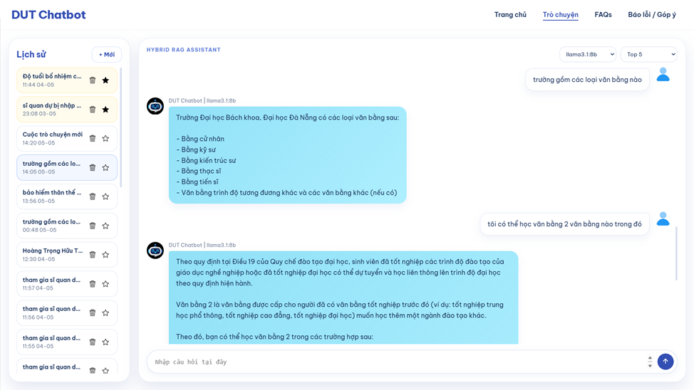
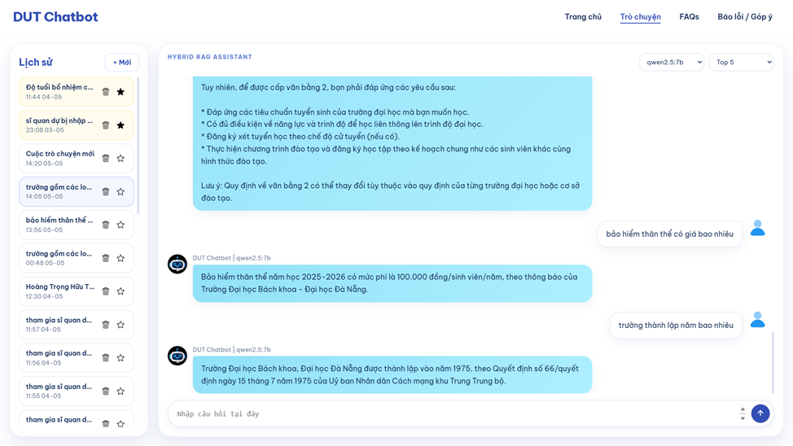

# DUT RAG Chatbot (Hybrid Neo4j + Qdrant)

Dự án xây dựng hệ thống hỏi–đáp theo mô hình **RAG** (Retrieve-Augment-Generate) cho dữ liệu văn bản hành chính/đào tạo, kết hợp:

- **Qdrant**: tìm kiếm vector semantic trên các *chunk*.
- **Neo4j**: lưu trữ và truy vấn quan hệ/tri thức có cấu trúc (graph facts).
- **Cross-Encoder reranker**: chấm lại các candidate trước khi đưa vào LLM.
- **LLM**: hỗ trợ qua **Groq** (hosted) hoặc **Ollama local**.


## Demo 

### 1) Demo với Llama



### 2) Demo với Qwen



## Kiến trúc tổng quan

Pipeline chính (theo mô tả trong backend):

1. Nhận câu hỏi user
2. Parse **entity/intent**
3. Chọn route:
   - `vector_only`: chỉ dùng Qdrant
   - `hybrid`: dùng **Neo4j + Qdrant**
4. Lấy candidate chunk từ **Qdrant**
5. Rerank bằng **CrossEncoder**
6. Ghép graph facts + chunk text thành context
7. Gọi LLM sinh đáp án


## Chạy dự án

### 1) Khởi động toàn bộ (backend + frontend)

Từ root project:

```powershell
.\friend_bundle\start_all.ps1
```

- Backend: `http://127.0.0.1:8000/health`
- Frontend: `http://127.0.0.1:4173`

### 2) Chạy riêng lẻ

Backend:

```powershell
.\friend_bundle\start_backend.ps1
```

Frontend:

```powershell
.\friend_bundle\start_fe.ps1
```

